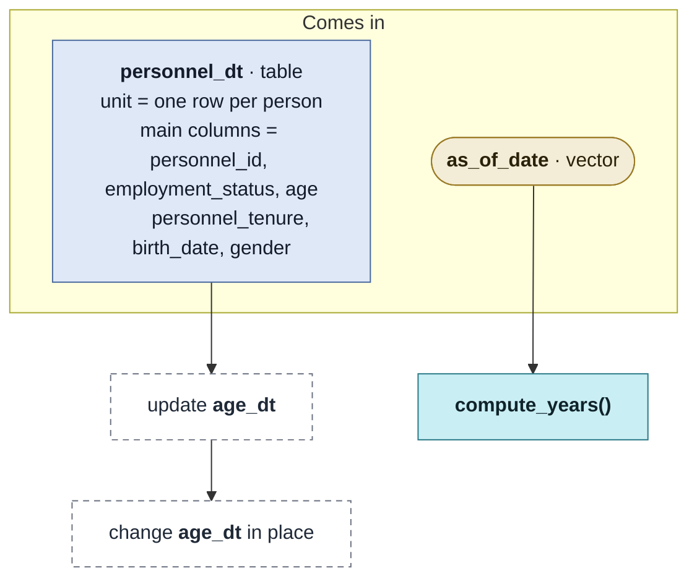

# `compute_age()`

Generated by `data-raw/schemas/build_code_map.R` from `R/utils.R`. Do not edit by hand.

```mermaid
flowchart TB
  subgraph G1["Comes in"]
    N2["<b>personnel_dt</b> · table<br/>unit = one row per person<br/>main columns = personnel_id, employment_status, age<br/>#160;#160;#160;#160;#160;#160;#160;#160;personnel_tenure, birth_date, gender"]
    N5(["<b>as_of_date</b> · vector"])
  end
  N1["update <b>age_dt</b>"]
  N3["change <b>age_dt</b> in place"]
  N4["<b>compute_years()</b>"]
  N2 --> N1
  N1 --> N3
  N5 --> N4
  classDef fn fill:#c9eef4,stroke:#2b7a87,color:#10232a
  classDef tbl fill:#dfe8f7,stroke:#4a6a9e,color:#141c2b
  classDef lst fill:#e3f1df,stroke:#4f8a45,color:#16240f
  classDef vec fill:#f3ecd6,stroke:#9a7b25,color:#2a2108
  classDef inl fill:#ffffff,stroke:#6b7280,stroke-dasharray:5 4,color:#1f2937
  classDef res fill:#f6d3c8,stroke:#b4573a,color:#2b130b
  class N4 fn
  class N2 tbl
  class N5 vec
  class N1,N3 inl
```

