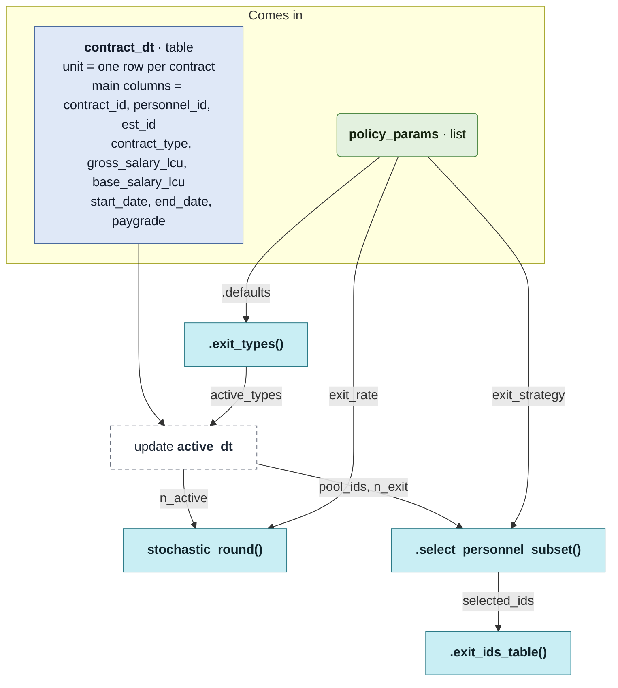

# `compute_fixed_rate_exits()`

Generated by `data-raw/schemas/build_code_map.R` from `R/exit_core.R`. Do not edit by hand.

```mermaid
flowchart TB
  subgraph G1["Comes in"]
    N1("<b>policy_params</b> · list")
    N4["<b>contract_dt</b> · table<br/>unit = one row per contract<br/>main columns = contract_id, personnel_id, est_id<br/>#160;#160;#160;#160;#160;#160;#160;#160;contract_type, gross_salary_lcu, base_salary_lcu<br/>#160;#160;#160;#160;#160;#160;#160;#160;start_date, end_date, paygrade"]
  end
  N2["<b>.exit_types()</b>"]
  N3["update <b>active_dt</b>"]
  N5["<b>stochastic_round()</b>"]
  N6["<b>.select_personnel_subset()</b>"]
  N7["<b>.exit_ids_table()</b>"]
  N1 -->|".defaults"| N2
  N4 --> N3
  N2 -->|"active_types"| N3
  N3 -->|"n_active"| N5
  N1 -->|"exit_rate"| N5
  N3 -->|"pool_ids, n_exit"| N6
  N1 -->|"exit_strategy"| N6
  N6 -->|"selected_ids"| N7
  classDef fn fill:#c9eef4,stroke:#2b7a87,color:#10232a
  classDef tbl fill:#dfe8f7,stroke:#4a6a9e,color:#141c2b
  classDef lst fill:#e3f1df,stroke:#4f8a45,color:#16240f
  classDef vec fill:#f3ecd6,stroke:#9a7b25,color:#2a2108
  classDef inl fill:#ffffff,stroke:#6b7280,stroke-dasharray:5 4,color:#1f2937
  classDef res fill:#f6d3c8,stroke:#b4573a,color:#2b130b
  class N2,N5,N6,N7 fn
  class N4 tbl
  class N1 lst
  class N3 inl
```

