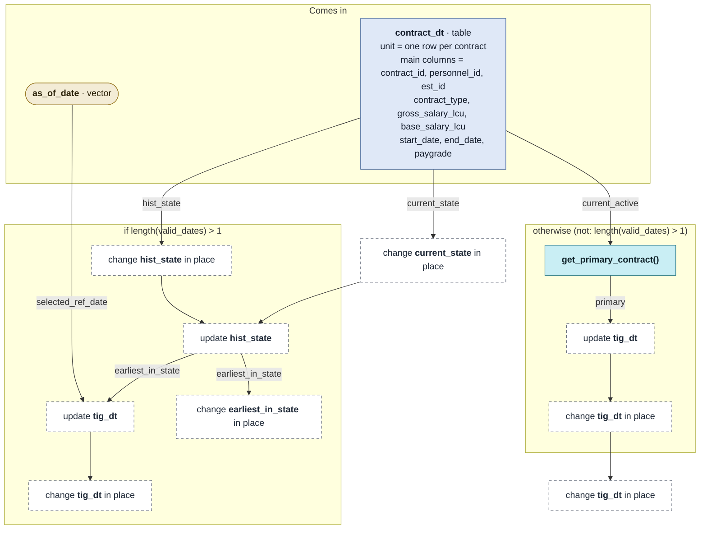

# `compute_time_in_grade()`

Generated by `data-raw/schemas/build_code_map.R` from `R/movement_core.R`. Do not edit by hand.

```mermaid
flowchart TB
  subgraph G1["Comes in"]
    N1(["<b>as_of_date</b> · vector"])
    N2["<b>contract_dt</b> · table<br/>unit = one row per contract<br/>main columns = contract_id, personnel_id, est_id<br/>#160;#160;#160;#160;#160;#160;#160;#160;contract_type, gross_salary_lcu, base_salary_lcu<br/>#160;#160;#160;#160;#160;#160;#160;#160;start_date, end_date, paygrade"]
  end
  subgraph G2["if length(valid_dates) #gt; 1"]
    N4["change <b>hist_state</b> in place"]
    N5["update <b>hist_state</b>"]
    N6["update <b>tig_dt</b>"]
    N7["change <b>earliest_in_state</b> in place"]
    N8["change <b>tig_dt</b> in place"]
  end
  subgraph G3["otherwise (not: length(valid_dates) #gt; 1)"]
    N9["<b>get_primary_contract()</b>"]
    N10["update <b>tig_dt</b>"]
    N11["change <b>tig_dt</b> in place"]
  end
  N3["change <b>current_state</b> in place"]
  N12["change <b>tig_dt</b> in place"]
  N2 -->|"current_state"| N3
  N2 -->|"hist_state"| N4
  N3 --> N5
  N4 --> N5
  N5 -->|"earliest_in_state"| N6
  N1 -->|"selected_ref_date"| N6
  N5 -->|"earliest_in_state"| N7
  N6 --> N8
  N2 -->|"current_active"| N9
  N9 -->|"primary"| N10
  N10 --> N11
  N11 --> N12
  classDef fn fill:#c9eef4,stroke:#2b7a87,color:#10232a
  classDef tbl fill:#dfe8f7,stroke:#4a6a9e,color:#141c2b
  classDef lst fill:#e3f1df,stroke:#4f8a45,color:#16240f
  classDef vec fill:#f3ecd6,stroke:#9a7b25,color:#2a2108
  classDef inl fill:#ffffff,stroke:#6b7280,stroke-dasharray:5 4,color:#1f2937
  classDef res fill:#f6d3c8,stroke:#b4573a,color:#2b130b
  class N9 fn
  class N2 tbl
  class N1 vec
  class N3,N4,N5,N6,N7,N8,N10,N11,N12 inl
```

