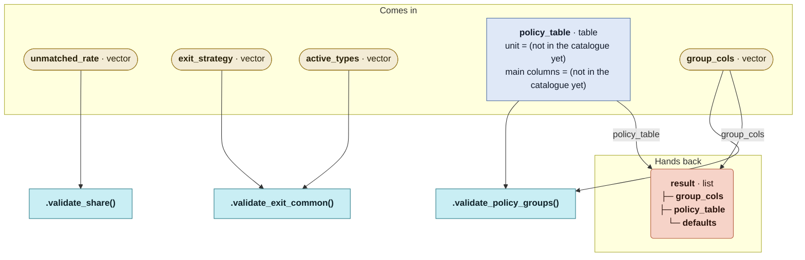

# `design_exit_policy_adjustment()`

Generated by `data-raw/schemas/build_code_map.R` from `R/exit_policy_helpers.R`. Do not edit by hand.

```mermaid
flowchart TB
  subgraph G1["Comes in"]
    N2(["<b>unmatched_rate</b> · vector"])
    N4(["<b>exit_strategy</b> · vector"])
    N5(["<b>active_types</b> · vector"])
    N7["<b>policy_table</b> · table<br/>unit = (not in the catalogue yet)<br/>main columns = (not in the catalogue yet)"]
    N8(["<b>group_cols</b> · vector"])
  end
  subgraph G2["Hands back"]
    N9("<b>result</b> · list<br/>├─ <b>group_cols</b><br/>├─ <b>policy_table</b><br/>└─ <b>defaults</b>")
  end
  N1["<b>.validate_share()</b>"]
  N3["<b>.validate_exit_common()</b>"]
  N6["<b>.validate_policy_groups()</b>"]
  N2 --> N1
  N4 --> N3
  N5 --> N3
  N7 --> N6
  N8 --> N6
  N8 -->|"group_cols"| N9
  N7 -->|"policy_table"| N9
  classDef fn fill:#c9eef4,stroke:#2b7a87,color:#10232a
  classDef tbl fill:#dfe8f7,stroke:#4a6a9e,color:#141c2b
  classDef lst fill:#e3f1df,stroke:#4f8a45,color:#16240f
  classDef vec fill:#f3ecd6,stroke:#9a7b25,color:#2a2108
  classDef inl fill:#ffffff,stroke:#6b7280,stroke-dasharray:5 4,color:#1f2937
  classDef res fill:#f6d3c8,stroke:#b4573a,color:#2b130b
  class N1,N3,N6 fn
  class N7 tbl
  class N2,N4,N5,N8 vec
  class N9 res
```

