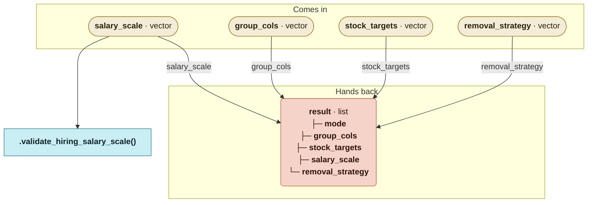

# `design_hiring_policy_stock()`

Generated by `data-raw/schemas/build_code_map.R` from `R/hiring_policy_helpers.R`. Do not edit by hand.

```mermaid
flowchart TB
  subgraph G1["Comes in"]
    N2(["<b>salary_scale</b> · vector"])
    N4(["<b>group_cols</b> · vector"])
    N5(["<b>stock_targets</b> · vector"])
    N6(["<b>removal_strategy</b> · vector"])
  end
  subgraph G2["Hands back"]
    N3("<b>result</b> · list<br/>├─ <b>mode</b><br/>├─ <b>group_cols</b><br/>├─ <b>stock_targets</b><br/>├─ <b>salary_scale</b><br/>└─ <b>removal_strategy</b>")
  end
  N1["<b>.validate_hiring_salary_scale()</b>"]
  N2 --> N1
  N4 -->|"group_cols"| N3
  N5 -->|"stock_targets"| N3
  N2 -->|"salary_scale"| N3
  N6 -->|"removal_strategy"| N3
  classDef fn fill:#c9eef4,stroke:#2b7a87,color:#10232a
  classDef tbl fill:#dfe8f7,stroke:#4a6a9e,color:#141c2b
  classDef lst fill:#e3f1df,stroke:#4f8a45,color:#16240f
  classDef vec fill:#f3ecd6,stroke:#9a7b25,color:#2a2108
  classDef inl fill:#ffffff,stroke:#6b7280,stroke-dasharray:5 4,color:#1f2937
  classDef res fill:#f6d3c8,stroke:#b4573a,color:#2b130b
  class N1 fn
  class N2,N4,N5,N6 vec
  class N3 res
```

