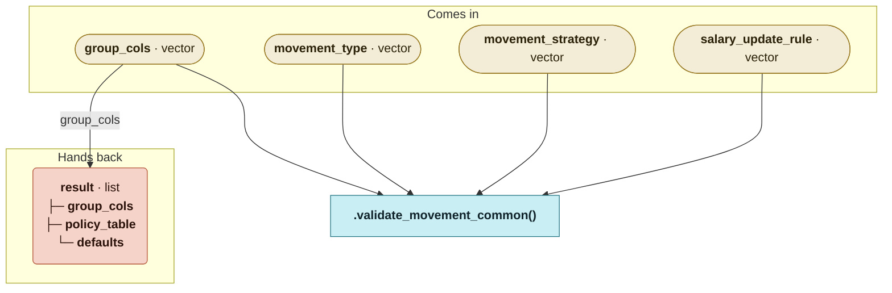

# `design_movement_policy_status_quo()`

Generated by `data-raw/schemas/build_code_map.R` from `R/movement_policy_helpers.R`. Do not edit by hand.

```mermaid
flowchart TB
  subgraph G1["Comes in"]
    N2(["<b>group_cols</b> · vector"])
    N3(["<b>movement_type</b> · vector"])
    N4(["<b>movement_strategy</b> · vector"])
    N5(["<b>salary_update_rule</b> · vector"])
  end
  subgraph G2["Hands back"]
    N6("<b>result</b> · list<br/>├─ <b>group_cols</b><br/>├─ <b>policy_table</b><br/>└─ <b>defaults</b>")
  end
  N1["<b>.validate_movement_common()</b>"]
  N2 --> N1
  N3 --> N1
  N4 --> N1
  N5 --> N1
  N2 -->|"group_cols"| N6
  classDef fn fill:#c9eef4,stroke:#2b7a87,color:#10232a
  classDef tbl fill:#dfe8f7,stroke:#4a6a9e,color:#141c2b
  classDef lst fill:#e3f1df,stroke:#4f8a45,color:#16240f
  classDef vec fill:#f3ecd6,stroke:#9a7b25,color:#2a2108
  classDef inl fill:#ffffff,stroke:#6b7280,stroke-dasharray:5 4,color:#1f2937
  classDef res fill:#f6d3c8,stroke:#b4573a,color:#2b130b
  class N1 fn
  class N2,N3,N4,N5 vec
  class N6 res
```

