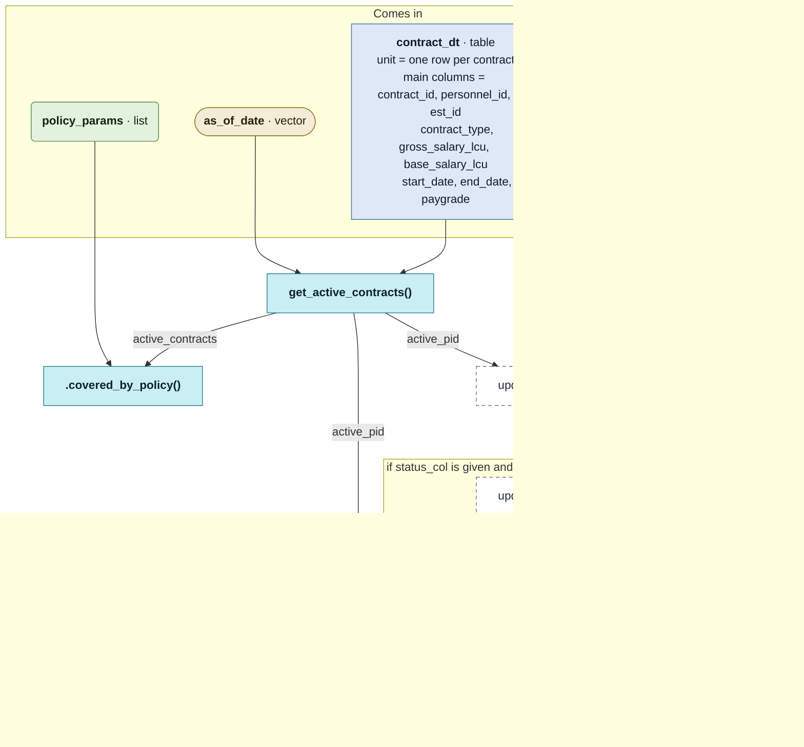

# `.filter_active_candidate_pool()`

Generated by `data-raw/schemas/build_code_map.R` from `R/retirement_core.R`. Do not edit by hand.

```mermaid
flowchart TB
  subgraph G1["Comes in"]
    N2["<b>contract_dt</b> · table<br/>unit = one row per contract<br/>main columns = contract_id, personnel_id, est_id<br/>#160;#160;#160;#160;#160;#160;#160;#160;contract_type, gross_salary_lcu, base_salary_lcu<br/>#160;#160;#160;#160;#160;#160;#160;#160;start_date, end_date, paygrade"]
    N3(["<b>as_of_date</b> · vector"])
    N5("<b>policy_params</b> · list")
    N7["<b>personnel_dt</b> · table<br/>unit = one row per person<br/>main columns = personnel_id, employment_status, age<br/>#160;#160;#160;#160;#160;#160;#160;#160;personnel_tenure, birth_date, gender"]
  end
  subgraph G2["if status_col is given and filtered_dt has the status_col column"]
    N8["update <b>filtered_dt</b>"]
  end
  subgraph G3["Hands back"]
    N9("<b>result</b> · list<br/>├─ <b>personnel_dt</b>: table, one row per person<br/>├─ <b>all_pid</b><br/>└─ <b>active_pid</b>")
  end
  N1["<b>get_active_contracts()</b>"]
  N4["<b>.covered_by_policy()</b>"]
  N6["update <b>filtered_dt</b>"]
  N2 --> N1
  N3 --> N1
  N1 -->|"active_contracts"| N4
  N5 --> N4
  N7 --> N6
  N1 -->|"active_pid"| N6
  N6 --> N8
  N8 -->|"personnel_dt"| N9
  N1 -->|"active_pid"| N9
  classDef fn fill:#c9eef4,stroke:#2b7a87,color:#10232a
  classDef tbl fill:#dfe8f7,stroke:#4a6a9e,color:#141c2b
  classDef lst fill:#e3f1df,stroke:#4f8a45,color:#16240f
  classDef vec fill:#f3ecd6,stroke:#9a7b25,color:#2a2108
  classDef inl fill:#ffffff,stroke:#6b7280,stroke-dasharray:5 4,color:#1f2937
  classDef res fill:#f6d3c8,stroke:#b4573a,color:#2b130b
  class N1,N4 fn
  class N2,N7 tbl
  class N5 lst
  class N3 vec
  class N6,N8 inl
  class N9 res
```

