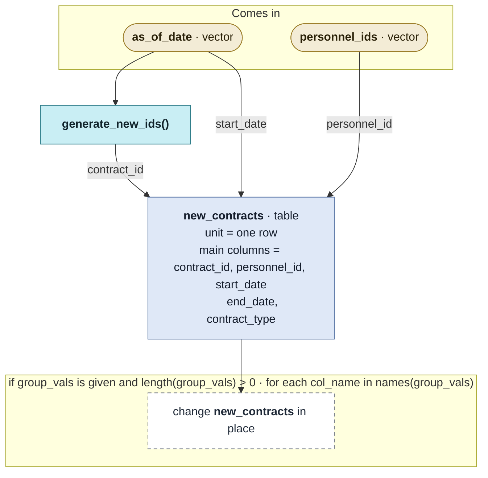

# `generate_new_contracts()`

Generated by `data-raw/schemas/build_code_map.R` from `R/hiring_update.R`. Do not edit by hand.

```mermaid
flowchart TB
  subgraph G1["Comes in"]
    N2(["<b>as_of_date</b> · vector"])
    N4(["<b>personnel_ids</b> · vector"])
  end
  subgraph G2["if group_vals is given and length(group_vals) #gt; 0 · for each col_name in names(group_vals)"]
    N5["change <b>new_contracts</b> in place"]
  end
  N1["<b>generate_new_ids()</b>"]
  N3["<b>new_contracts</b> · table<br/>unit = one row<br/>main columns = contract_id, personnel_id, start_date<br/>#160;#160;#160;#160;#160;#160;#160;#160;end_date, contract_type"]
  N2 --> N1
  N1 -->|"contract_id"| N3
  N4 -->|"personnel_id"| N3
  N2 -->|"start_date"| N3
  N3 --> N5
  classDef fn fill:#c9eef4,stroke:#2b7a87,color:#10232a
  classDef tbl fill:#dfe8f7,stroke:#4a6a9e,color:#141c2b
  classDef lst fill:#e3f1df,stroke:#4f8a45,color:#16240f
  classDef vec fill:#f3ecd6,stroke:#9a7b25,color:#2a2108
  classDef inl fill:#ffffff,stroke:#6b7280,stroke-dasharray:5 4,color:#1f2937
  classDef res fill:#f6d3c8,stroke:#b4573a,color:#2b130b
  class N1 fn
  class N3 tbl
  class N2,N4 vec
  class N5 inl
```

