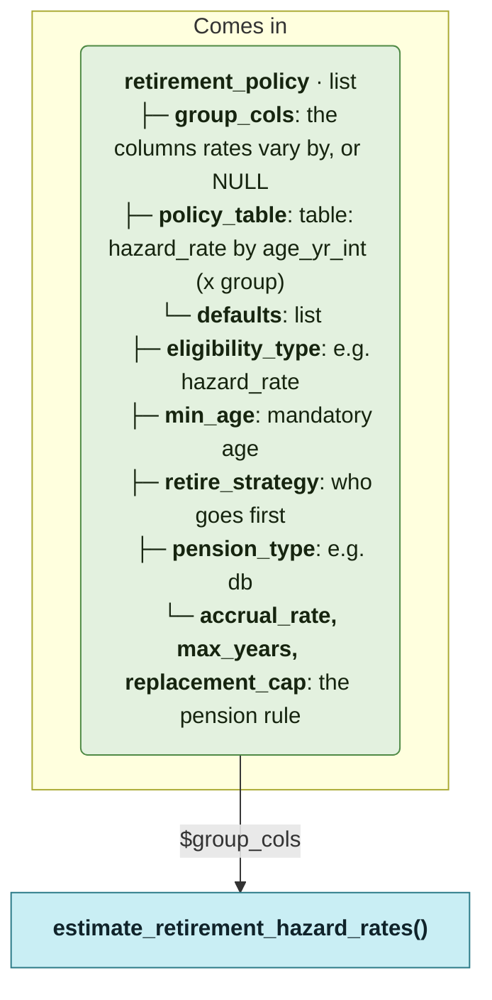

# `precompute_retirement_rates()`

Generated by `data-raw/schemas/build_code_map.R` from `R/horizon_core.R`. Do not edit by hand.

```mermaid
flowchart TB
  subgraph G1["Comes in"]
    N2("<b>retirement_policy</b> · list<br/>├─ <b>group_cols</b>: the columns rates vary by, or NULL<br/>├─ <b>policy_table</b>: table: hazard_rate by age_yr_int (x group)<br/>└─ <b>defaults</b>: list<br/>#160;#160;#160;#160;├─ <b>eligibility_type</b>: e.g. hazard_rate<br/>#160;#160;#160;#160;├─ <b>min_age</b>: mandatory age<br/>#160;#160;#160;#160;├─ <b>retire_strategy</b>: who goes first<br/>#160;#160;#160;#160;├─ <b>pension_type</b>: e.g. db<br/>#160;#160;#160;#160;└─ <b>accrual_rate, max_years, replacement_cap</b>: the pension rule")
  end
  N1["<b>estimate_retirement_hazard_rates()</b>"]
  N2 -->|"$group_cols"| N1
  classDef fn fill:#c9eef4,stroke:#2b7a87,color:#10232a
  classDef tbl fill:#dfe8f7,stroke:#4a6a9e,color:#141c2b
  classDef lst fill:#e3f1df,stroke:#4f8a45,color:#16240f
  classDef vec fill:#f3ecd6,stroke:#9a7b25,color:#2a2108
  classDef inl fill:#ffffff,stroke:#6b7280,stroke-dasharray:5 4,color:#1f2937
  classDef res fill:#f6d3c8,stroke:#b4573a,color:#2b130b
  class N1 fn
  class N2 lst
```

