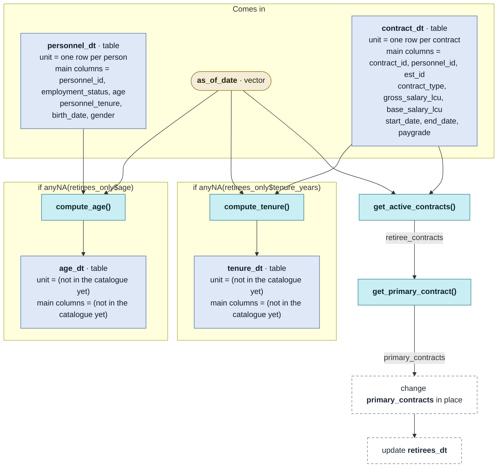

# `prepare_retiree_data()`

Generated by `data-raw/schemas/build_code_map.R` from `R/retirement_core.R`. Do not edit by hand.

```mermaid
flowchart TB
  subgraph G1["Comes in"]
    N2["<b>personnel_dt</b> · table<br/>unit = one row per person<br/>main columns = personnel_id, employment_status, age<br/>#160;#160;#160;#160;#160;#160;#160;#160;personnel_tenure, birth_date, gender"]
    N3(["<b>as_of_date</b> · vector"])
    N6["<b>contract_dt</b> · table<br/>unit = one row per contract<br/>main columns = contract_id, personnel_id, est_id<br/>#160;#160;#160;#160;#160;#160;#160;#160;contract_type, gross_salary_lcu, base_salary_lcu<br/>#160;#160;#160;#160;#160;#160;#160;#160;start_date, end_date, paygrade"]
  end
  subgraph G2["if anyNA(retirees_only$age)"]
    N1["<b>compute_age()</b>"]
    N4["<b>age_dt</b> · table<br/>unit = (not in the catalogue yet)<br/>main columns = (not in the catalogue yet)"]
  end
  subgraph G3["if anyNA(retirees_only$tenure_years)"]
    N5["<b>compute_tenure()</b>"]
    N7["<b>tenure_dt</b> · table<br/>unit = (not in the catalogue yet)<br/>main columns = (not in the catalogue yet)"]
  end
  N8["<b>get_active_contracts()</b>"]
  N9["<b>get_primary_contract()</b>"]
  N10["change <b>primary_contracts</b> in place"]
  N11["update <b>retirees_dt</b>"]
  N2 --> N1
  N3 --> N1
  N1 --> N4
  N6 --> N5
  N3 --> N5
  N5 --> N7
  N6 --> N8
  N3 --> N8
  N8 -->|"retiree_contracts"| N9
  N9 -->|"primary_contracts"| N10
  N10 --> N11
  classDef fn fill:#c9eef4,stroke:#2b7a87,color:#10232a
  classDef tbl fill:#dfe8f7,stroke:#4a6a9e,color:#141c2b
  classDef lst fill:#e3f1df,stroke:#4f8a45,color:#16240f
  classDef vec fill:#f3ecd6,stroke:#9a7b25,color:#2a2108
  classDef inl fill:#ffffff,stroke:#6b7280,stroke-dasharray:5 4,color:#1f2937
  classDef res fill:#f6d3c8,stroke:#b4573a,color:#2b130b
  class N1,N5,N8,N9 fn
  class N2,N4,N6,N7 tbl
  class N3 vec
  class N10,N11 inl
```

Steps with their own flow: 
- [`compute_age()`](compute_age.md)
