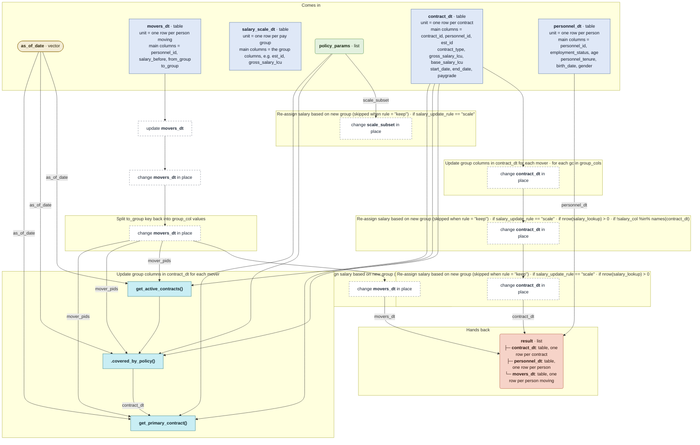

# `update_state_with_movement()`

Generated by `data-raw/schemas/build_code_map.R` from `R/movement_update.R`. Do not edit by hand.

```mermaid
flowchart TB
  subgraph G1["Comes in"]
    N1(["<b>as_of_date</b> · vector"])
    N3["<b>movers_dt</b> · table<br/>unit = one row per person moving<br/>main columns = personnel_id, salary_before, from_group<br/>#160;#160;#160;#160;#160;#160;#160;#160;to_group"]
    N5["<b>salary_scale_dt</b> · table<br/>unit = one row per pay group<br/>main columns = the group columns, e.g. est_id, gross_salary_lcu"]
    N6("<b>policy_params</b> · list")
    N9["<b>contract_dt</b> · table<br/>unit = one row per contract<br/>main columns = contract_id, personnel_id, est_id<br/>#160;#160;#160;#160;#160;#160;#160;#160;contract_type, gross_salary_lcu, base_salary_lcu<br/>#160;#160;#160;#160;#160;#160;#160;#160;start_date, end_date, paygrade"]
    N18["<b>personnel_dt</b> · table<br/>unit = one row per person<br/>main columns = personnel_id, employment_status, age<br/>#160;#160;#160;#160;#160;#160;#160;#160;personnel_tenure, birth_date, gender"]
  end
  subgraph G2["Split to_group key back into group_col values"]
    N7["change <b>movers_dt</b> in place"]
  end
  subgraph G3["Update group columns in contract_dt for each mover"]
    N8["<b>get_primary_contract()</b>"]
    N10["<b>.covered_by_policy()</b>"]
    N11["<b>get_active_contracts()</b>"]
  end
  subgraph G5["Update group columns in contract_dt for each mover · for each gc in group_cols"]
    N12["change <b>contract_dt</b> in place"]
  end
  subgraph G7["Re-assign salary based on new group (skipped when rule = #quot;keep#quot;) · if salary_update_rule == #quot;scale#quot;"]
    N13["change <b>scale_subset</b> in place"]
  end
  subgraph G8["Re-assign salary based on new group (skipped when rule = #quot;keep#quot;) · if salary_update_rule == #quot;scale#quot; · if nrow(salary_lookup) #gt; 0"]
    N15["change <b>contract_dt</b> in place"]
  end
  subgraph G9["Re-assign salary based on new group (skipped when rule = #quot;keep#quot;) · if salary_update_rule == #quot;scale#quot; · if nrow(salary_lookup) #gt; 0 · if !salary_col %in% names(contract_dt)"]
    N14["change <b>contract_dt</b> in place"]
  end
  subgraph G10["Re-assign salary based on new group (skipped when rule = #quot;keep#quot;)"]
    N16["change <b>movers_dt</b> in place"]
  end
  subgraph G11["Hands back"]
    N17("<b>result</b> · list<br/>├─ <b>contract_dt</b>: table, one row per contract<br/>├─ <b>personnel_dt</b>: table, one row per person<br/>└─ <b>movers_dt</b>: table, one row per person moving")
  end
  N2["update <b>movers_dt</b>"]
  N4["change <b>movers_dt</b> in place"]
  N3 --> N2
  N2 --> N4
  N4 --> N7
  N9 --> N8
  N7 -->|"mover_pids"| N8
  N1 -->|"as_of_date"| N8
  N6 --> N8
  N9 --> N10
  N7 -->|"mover_pids"| N10
  N1 -->|"as_of_date"| N10
  N6 --> N10
  N10 -->|"contract_dt"| N8
  N9 --> N11
  N7 -->|"mover_pids"| N11
  N1 -->|"as_of_date"| N11
  N11 --> N10
  N9 --> N12
  N6 -->|"scale_subset"| N13
  N12 --> N14
  N14 --> N15
  N7 --> N16
  N15 -->|"contract_dt"| N17
  N18 -->|"personnel_dt"| N17
  N16 -->|"movers_dt"| N17
  classDef fn fill:#c9eef4,stroke:#2b7a87,color:#10232a
  classDef tbl fill:#dfe8f7,stroke:#4a6a9e,color:#141c2b
  classDef lst fill:#e3f1df,stroke:#4f8a45,color:#16240f
  classDef vec fill:#f3ecd6,stroke:#9a7b25,color:#2a2108
  classDef inl fill:#ffffff,stroke:#6b7280,stroke-dasharray:5 4,color:#1f2937
  classDef res fill:#f6d3c8,stroke:#b4573a,color:#2b130b
  class N8,N10,N11 fn
  class N3,N5,N9,N18 tbl
  class N6 lst
  class N1 vec
  class N2,N4,N7,N12,N13,N14,N15,N16 inl
  class N17 res
```

